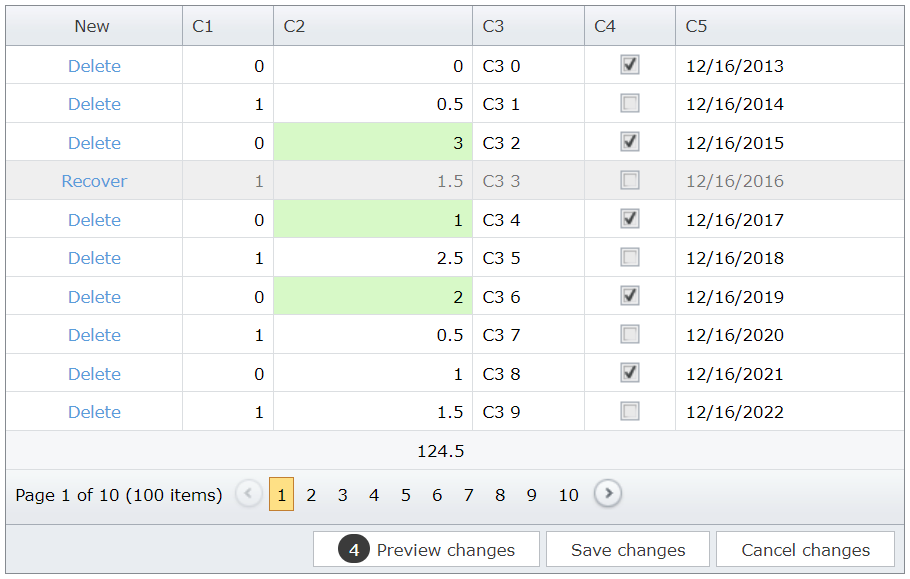

<!-- default badges list -->

[](https://supportcenter.devexpress.com/ticket/details/T137186)
[](https://docs.devexpress.com/GeneralInformation/403183)
[](#does-this-example-address-your-development-requirementsobjectives)
<!-- default badges end -->
# Grid View for ASP.NET MVC - How to update total summaries on the client in batch edit mode

This example demonstrates how to replace a summary item with a custom footer template to calculate the total summary dynamically in batch edit mode.



## Overview

Follow the steps below to update total summaries on the client in batch edit mode:

1. Add a total summary item for the corresponding column. Use the item's [Tag](https://docs.devexpress.com/AspNet/DevExpress.Web.ASPxSummaryItemBase.Tag) property to identify the summary item and get its value.

    ```cs
    settings.Columns.Add(column => {
	column.FieldName = "C2";
	column.ColumnType = MVCxGridViewColumnType.SpinEdit;

	ASPxSummaryItem summaryItem = new ASPxSummaryItem(column.FieldName, DevExpress.Data.SummaryItemType.Sum);
	summaryItem.Tag = column.FieldName + "_Sum";
	summaryItem.DisplayFormat = "{0}";
	settings.TotalSummary.Add(summaryItem);
    });
    ```

2. Replace the summary item with a custom [footer template](https://docs.devexpress.com/AspNetMvc/DevExpress.Web.Mvc.MVCxGridViewColumn.SetFooterTemplateContent.overloads).

    ```cshtml
	column.SetFooterTemplateContent(c => {
		Html.DevExpress().Label(lbSettings => {
			string fieldName = (c.Column as GridViewDataColumn).FieldName;
			lbSettings.Name = "labelSum";
			lbSettings.Properties.EnableClientSideAPI = true;
			ASPxSummaryItem summaryItem1 = c.Grid.TotalSummary.First(i => i.Tag == (fieldName + "_Sum"));
			lbSettings.Text = c.Grid.GetTotalSummaryValue(summaryItem1).ToString();
		}).Render();
	});
    ```

3. Handle the grid's client-side [BatchEditEndEditing](https://docs.devexpress.com/AspNet/js-ASPxClientGridView.BatchEditEndEditing) and [BatchEditRowDeleting](https://docs.devexpress.com/AspNet/js-ASPxClientGridView.BatchEditRowDeleting) events. In handlers, use the grid's [batchEditApi.GetCellValue](https://docs.devexpress.com/AspNet/js-ASPxClientGridViewBatchEditApi.GetCellValue(visibleIndex-columnFieldNameOrId)) method to get initial cell values and `rowValues` argument property to get new cell values. Then recalculate the summary value and assign it to the label.

    ```js
    function OnBatchEditEndEditing(s, e) {
        CalculateSummary(s, e.rowValues, e.visibleIndex, false);
    }
    function CalculateSummary(grid, rowValues, visibleIndex, isDeleting) {
        var originalValue = grid.batchEditApi.GetCellValue(visibleIndex, "C2");
        var newValue = rowValues[(grid.GetColumnByField("C2").index)].value;
        var dif = isDeleting ? -newValue : newValue - originalValue;
        labelSum.SetValue((parseFloat(labelSum.GetValue()) + dif).toFixed(1));
    }
    function OnBatchEditRowDeleting(s, e) {
        CalculateSummary(s, e.rowValues, e.visibleIndex, true);
    }
    function OnChangesCanceling(s, e) {
        if (s.batchEditApi.HasChanges())
            setTimeout(function () {
                s.Refresh();
            }, 0);
    }
    ```

## Files to Review

* [HomeController.cs](./CS/GridViewBatchEdit/Controllers/HomeController.cs) (VB: [HomeController.vb](./VB/GridViewBatchEdit/Controllers/HomeController.vb))
* [_GridViewPartial.cshtml](./CS/GridViewBatchEdit/Views/Home/_GridViewPartial.cshtml)
* [Index.cshtml](./CS/GridViewBatchEdit/Views/Home/Index.cshtml)

## Documentation

* [Grid in Batch Edit Mode](https://docs.devexpress.com/AspNetMvc/16147/components/grid-view/data-editing-and-validation/batch-edit)

## More Examples

* [Grid View for ASP.NET Web Forms - How to update total summaries on the client in batch edit mode](https://github.com/DevExpress-Examples/asp-net-web-forms-grid-update-total-summaries-on-client-in-batch-mode)
* [Grid View for ASP.NET MVC - How to calculate values dynamically in batch edit mode](https://github.com/DevExpress-Examples/asp-net-mvc-grid-dynamic-calculation-in-batch-mode)
* [Grid View for ASP.NET MVC - How to calculate values and total summaries dynamically in batch edit mode](https://github.com/DevExpress-Examples/gridview-batch-edit-how-to-calculate-unbound-column-and-total-summary-values-on-the-fly-t124151)
<!-- feedback -->
## Does this example address your development requirements/objectives?

[](https://www.devexpress.com/support/examples/survey.xml?utm_source=github&utm_campaign=asp-net-mvc-grid-update-total-summaries-on-client-in-batch-mode&~~~was_helpful=yes) [](https://www.devexpress.com/support/examples/survey.xml?utm_source=github&utm_campaign=asp-net-mvc-grid-update-total-summaries-on-client-in-batch-mode&~~~was_helpful=no)

(you will be redirected to DevExpress.com to submit your response)
<!-- feedback end -->
